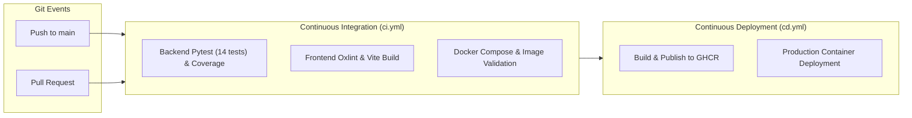

# AI Traffic Prediction & Dynamic Route Optimization System

[](https://github.com/DHANUSH-PRO11/AI-Traffic-Prediction/actions/workflows/ci.yml)
[](https://github.com/DHANUSH-PRO11/AI-Traffic-Prediction/actions/workflows/cd.yml)


A production-quality full-stack intelligent transportation platform combining machine learning continuous travel-time regression, dynamic graph shortest-path routing (A* and Dijkstra), live traffic map visualization, real-time incident mitigation, user trip logging, and automated model retraining.

---

## 🚀 Key Highlights & Architectural Features

1. **Continuous Machine Learning Target**:
   - Predicts continuous **travel time** and **average speed (km/h)** for every road segment, rather than simple discrete categories.
   - Vectorized Gradient Boosted Decision Tree (GBDT) Regressor with exact feature importances (e.g. historical speed, lag speed, time of day, weather, accident presence).
2. **Graph Shortest-Path Routing**:
   - Primary edge weight = **predicted travel time (minutes)**.
   - **A* Algorithm**: Uses an admissible heuristic based on geodesic Haversine distance divided by maximum permissible network speed ($f(n) = g(n) + h(n)$).
   - **Dijkstra's Algorithm**: Weighted path exploration.
   - **Alternative Routes**: Penalizes primary segments to generate distinct alternative paths and compute **estimated time saved**.
3. **Dynamic Incident Recalculation**:
   - When accidents or lane blockages occur, edge weights dynamically spike, triggering real-time route re-evaluation and displaying clear reroute alerts.
4. **Continuous Learning Loop**:
   - User-completed trips are stored in the database.
   - Retraining pipeline validates candidate models against test sets and promotes new versions only upon measurable accuracy improvement.
5. **Interactive Full-Stack Web Application**:
   - Modern React + Vite + Tailwind CSS dashboard with dark-mode glassmorphism.
   - Interactive Leaflet + OpenStreetMap engine rendering all segments with live traffic colors.

---

## 🛠 Tech Stack

- **Frontend**: React 18, Vite, Tailwind CSS, Leaflet, React-Leaflet, Recharts, Axios, React Router, Lucide Icons
- **Backend**: Python 3.11+, FastAPI, Pydantic v2, SQLAlchemy, Uvicorn, SQLite / PostgreSQL + PostGIS
- **Machine Learning**: Custom vectorized Gradient Boosted Decision Tree (GBDT) Regressor, NumPy, Joblib, Scikit-learn feature pipeline
- **Testing**: Python `unittest`, `httpx` / FastAPI `TestClient`
- **Containerization**: Docker, Docker Compose, Nginx

---

## 📁 Repository Structure

```text
smart-traffic-ai/
├── frontend/                     # React + Vite + Tailwind CSS + Leaflet UI
│   ├── src/
│   │   ├── api/client.js         # Axios API clients
│   │   ├── layouts/AppLayout.jsx # App navigation and status bar
│   │   ├── pages/                # Dashboard, MapRoute, Predict, Analytics, Trips, ModelInfo, Admin
│   │   └── index.css             # Tailwind v4 & Leaflet styling
│   └── package.json
│
├── backend/                      # Python FastAPI application
│   ├── app/
│   │   ├── api/                  # REST routers (auth, traffic, routes, roads, weather, accidents, trips, ml, analytics)
│   │   ├── core/config.py        # Settings and environment configs
│   │   ├── database/             # SQLAlchemy engine & table schemas
│   │   ├── models/models.py      # ORM Models (User, RoadSegment, TrafficObservation, etc.)
│   │   ├── schemas/schemas.py    # Pydantic request & response validation
│   │   ├── services/             # TrafficService & IncidentService
│   │   ├── routing/              # Graph builder, Dijkstra, and A* pathfinding
│   │   ├── ml/                   # GBDT Regressor, feature pipeline, and predictor service
│   │   └── main.py               # FastAPI entry point
│   └── requirements.txt
│
├── ml/
│   ├── data/raw/                 # Network nodes, segments, and 16,128 traffic observations
│   └── models/                   # Serialized model weights & metadata JSON
│
├── scripts/
│   ├── download_data.py          # Generates realistic network and 14-day loop detector observations
│   ├── train_model.py            # Trains GBDT model, evaluates, and registers active model
│   └── seed_database.py          # Seeds database tables
│
├── tests/
│   ├── test_routing.py           # Tests A*, Dijkstra, and dynamic incident rerouting
│   ├── test_ml_prediction.py     # Tests ML predictor, bounds, and accident speed penalties
│   └── test_api.py               # Integration tests for all REST endpoints
│
├── docker/                       # Dockerfiles and Nginx configuration
├── docker-compose.yml
├── .env.example
└── README.md
```

---

## ⚡ Quick Start Guide

### 1. Prerequisites
- Python 3.11+
- Node.js 18+ and npm

### 2. Generate Dataset & Train ML Model
```bash
# 1. Generate road network topology and 16,128 synthetic traffic observation records
python scripts/download_data.py

# 2. Train the Gradient Boosted Decision Tree (GBDT) model using time-aware splitting
python scripts/train_model.py
```

### 3. Initialize Database
```bash
python -c "import sys; sys.path.insert(0, 'backend'); from app.database.init_db import init_database; init_database()"
```

### 4. Run Backend Server
```bash
cd backend
python -m uvicorn app.main:app --host 127.0.0.1 --port 8000 --reload
```
- Interactive Swagger API Documentation: `http://localhost:8000/docs`
- Redoc API Documentation: `http://localhost:8000/redoc`

### 5. Run Frontend Application
```bash
cd frontend
npm install
npm run dev
```
- Open browser at `http://localhost:5173`

---

## 🧪 Running Unit & Integration Tests

Run the comprehensive test suite verifying graph routing, ML prediction, and REST endpoints:
```bash
python -m unittest discover -s tests -p "test_*.py"
```

---

## 🐳 Docker Compose (PostgreSQL + PostGIS + FastAPI + Nginx)

To start the complete multi-container stack:
```bash
docker-compose up --build
```
- Frontend: `http://localhost:3000`
- Backend API: `http://localhost:8000`
- PostgreSQL / PostGIS: `localhost:5432`

---

## 📡 API Reference Overview

| Endpoint | Method | Description |
|---|---|---|
| `/api/traffic/current` | GET | System-wide traffic status, segment colors, active accidents |
| `/api/traffic/history` | GET | 24-hour historical vs predicted volume and speed curves |
| `/api/traffic/predict` | POST | Interactive ML inference for road segment with weather & time |
| `/api/routes/calculate` | POST | Computes fastest route using A* or Dijkstra with alternative routes |
| `/api/roads` | GET | Complete list of road segments with live speeds and lengths |
| `/api/roads/nodes` | GET | Metropolitan network nodes with coordinates |
| `/api/accidents` | GET/POST | Query or simulate live incidents / road closures |
| `/api/accidents/{id}` | DELETE | Resolve incident and trigger route restoration |
| `/api/trips` | GET/POST | Log completed commuter trips for continuous learning |
| `/api/ml/model` | GET | Active ML model metadata, version, and training dataset |
| `/api/ml/metrics` | GET | Real trained feature importances and evaluation metrics |
| `/api/ml/train` | POST | Retrain candidate model and auto-deploy upon improved metrics |
| `/api/analytics/traffic` | GET | Congestion distribution and corridor efficiency analytics |

---

## 🧠 Continuous Learning Workflow

1. Drivers complete routes via the application.
2. Actual travel times and routes are stored in the `user_trips` table.
3. System triggers periodic or on-demand retraining via `/api/ml/train` or `scripts/train_model.py`.
4. Candidate models are evaluated on unseen time-series validation sets.
5. If candidate MAE / RMSE demonstrates improved accuracy, the model is automatically promoted to production without system downtime.

---

## 🔄 CI/CD Automation & DevOps Pipeline

The repository includes a production-grade **GitHub Actions CI/CD Pipeline** designed for high reliability, automated regression testing, and zero-downtime container publishing.



### 1. Continuous Integration (`.github/workflows/ci.yml`)
- **Backend Testing & Coverage**: Runs Python 3.11 with cached pip dependencies. Executes the full 14-test suite (`pytest`), validates ML feature pipelines, Dijkstra/A* routing, and REST endpoints, outputting Cobertura XML coverage artifacts.
- **Frontend Validation**: Runs Node.js 20 with cached npm dependencies. Performs `oxlint` static code analysis and executes `vite build` to guarantee zero frontend bundling issues.
- **Docker Validation**: Synthesizes and tests `docker-compose.yml` and builds both `Dockerfile.backend` and `Dockerfile.frontend` using Buildx with GitHub Actions caching.

### 2. Continuous Delivery (`.github/workflows/cd.yml`)
- **Container Registry Publishing**: Automatically builds multi-platform OCI images and publishes them to **GitHub Container Registry (GHCR)**:
  - `ghcr.io/dhanush-pro11/ai-traffic-prediction/backend:latest`
  - `ghcr.io/dhanush-pro11/ai-traffic-prediction/frontend:latest`
- **Release Tagging**: Generates semantic tags (`vX.Y.Z`) and commit SHA tracking (`sha-<commit>`).

### 3. Automated Dependency Updates (`.github/dependabot.yml`)
- Weekly automated vulnerability alerts and version PRs for Python backend packages and npm frontend libraries.

### 4. Running CI/CD Verifications Locally
```bash
# Run all backend tests
npm test

# Run frontend code linting
npm run lint

# Build production frontend bundle
npm run build

# Run integrated CI test command
npm run test:ci
```

